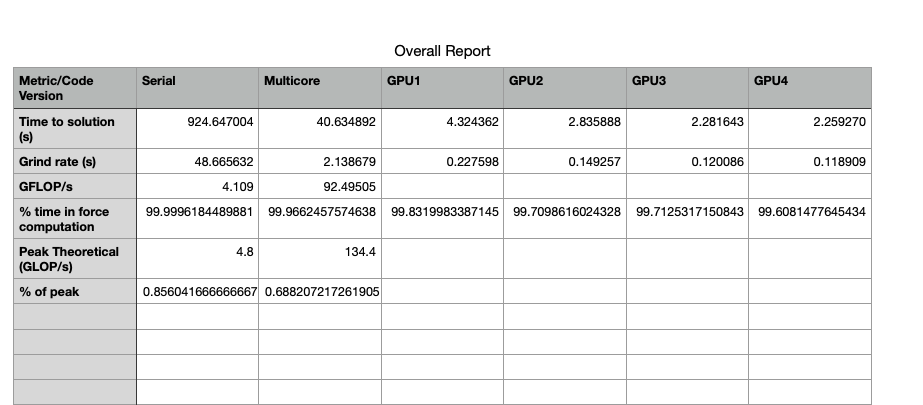
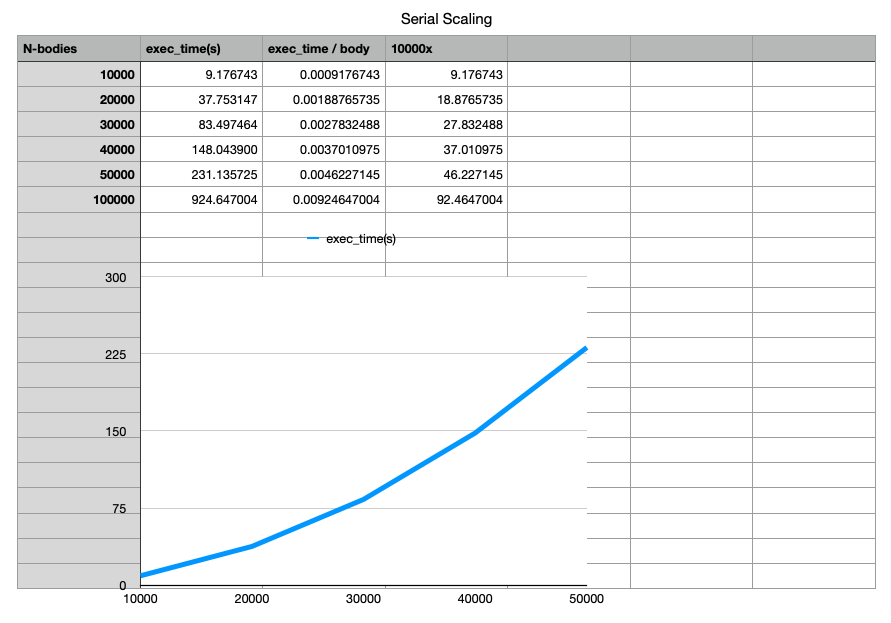
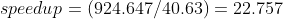
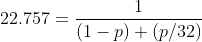
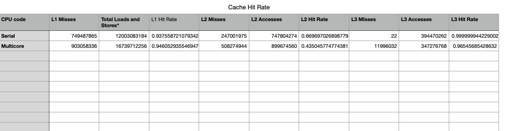
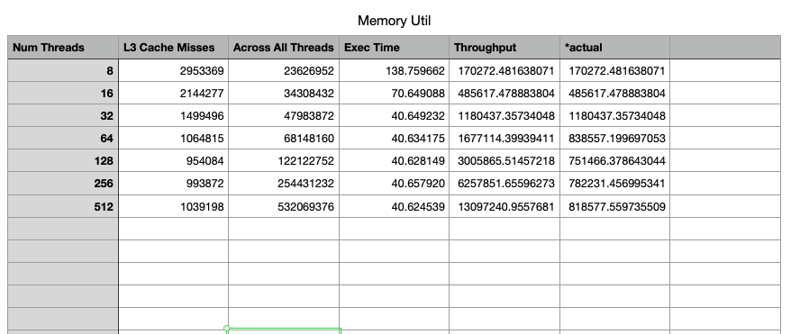
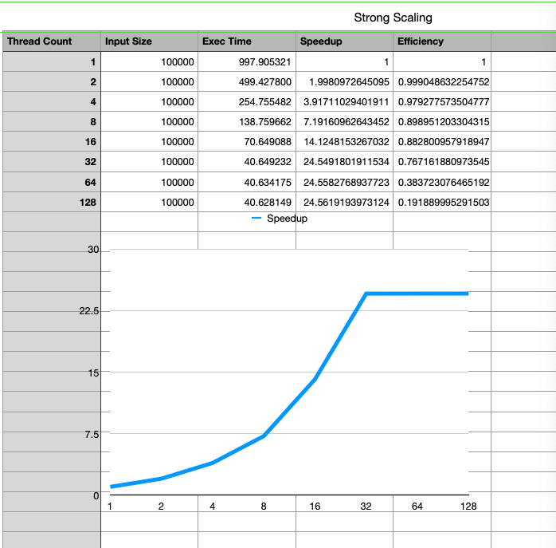
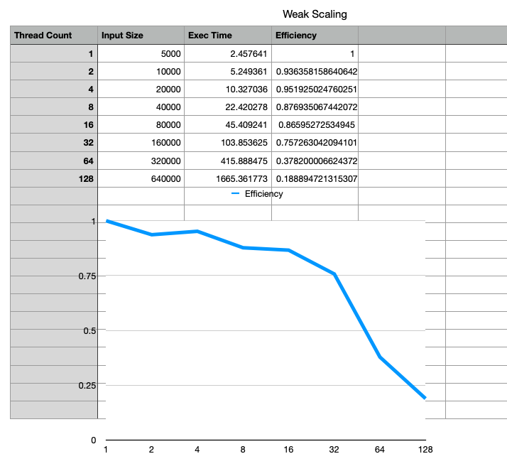
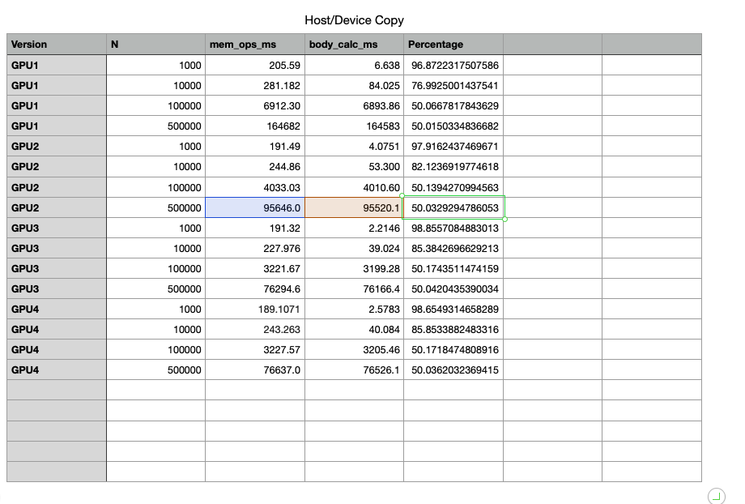

# Project 2 Write-up

This is the write-up for project 2. We answer each question (to our best ability, shortcomings are mentioned) below.

## 1
### Comparison Table

Note: I had trouble getting metrics to work in order to calculating FLOP/s numerically on GPU. Hence the blank section.

We can clearly see that this code benefits greatly when run on a GPU (which makes sense given its SIMD nature)

## 2
### Serial Time Complexity

The complexity can be outlined by the following table.

The last column shows the relative ratio of time to nbody. Given the
terms, 9, 18, 27, 37... we can roughly say that this routine has O(n^2)
complexity.

This makes sense, given from analytic perspective, we are calculating forces
between each pair of particles, which should naturally arrive at a O(n^2) runtime
assuming a serial computer.

## 3
### Analytic Aritmetic Complexity

## 4
### GPU v. CPU Speedup

Referencing our table in #1, we can see that the peak CPU scaling is at 40s and the peak GPU scaling is at 2.25s. This
nets us a relative speedup of 17.98.

(It should be pretty clear that GPU will definitely have a higher performance/dollar -- considering GPU cost scalability is
definitely not north of 18)

## 5
### Amdahl Ceiling n=100000

Using a thread count of 32 and comparing against our serial run...

We have the following equation, where we can solve for the fraction of execution time affected by the speedup. We can use
this to get our percentage of sequential execution (and optimal bound).

Solving for `p` gives us `0.9868`. Which tells us that our bound (our sequential) is at `1.3%`.

## 6
### Amdahl Ceiling n=500000

Using a thread count of 32...following the same steps as above.

Sequential 500k = ?
Parallel32 500k = 1016.639743

Note: Doing a sequential run for 500k will probably take more time than I can afford right now. Will come back around
if I have time remaining.

<!--

Solving for `p` gives us `0.9868`. Which tells us that our bound (our sequential) is at `1.3%`.-->

## 7
### Compute or Memory Bound

My approach here given the relatively limited set of counters we have is to compare of ratio of the following two counters.

- PAPI_STL_CCY (Papi cycles that resulted in no instructions being completed)
- PAPI_TOT_CYC (Papi total cycles)

The thought here is that a higher ratio of PAPI_STL_CCY / PAPI_TOT_CYC would indicate a memory bound routine, a lesser ratio
indidcating a cpu bound routine.

When running for n=50000...

PAPI_STL_CCY = 273429250826

PAPI_TOT_CYC = 800989736575

Which gives us roughly 34% stalled cycles. This would indicate that our code is still compute-bound and could see further imrprovement
if clock speed were increased (with a 0.66 improvement, essentially)

## 8
### CPU ICC

Using the timing from the next question (#9). We compare the following

- GCC: 924.647 (from #1)
- ICC: 265.059 (from #9, with vectorization)

Actually if you look at the no-vec from #9, we can see that the vast majority of this speedup is due to ICC
vectorization in O2. I imagine in GCC, vectorization isn't done by default at O2.

## 9
### Vectorized Instructions

The following loops/instructions get vectorized in ICC (made sure to turn on AVX vectorization explicitly as well)

- Inner loop (only) gets vectorized in our force calculation function.
- The position update loop gets fully vectorized.

When comparing vectorization against no vec
- W/vec: 265.058975
- Wo/vec: 923.806719

So clearly we see significant improvement when explicitly allowing vectorization to occur. This makes sense since the major
computationally intensive loop in our force computation subroutine is naturally a SIMD operation, which will benefit vastly
from vectorization in ICC.

#### Vectorization Report

    Intel(R) Advisor can now assist with vectorization and show optimization
    report messages with your source code.
    See "https://software.intel.com/en-us/intel-advisor-xe" for details.

        Report from: Interprocedural optimizations [ipo]

    INLINING OPTION VALUES:
    -inline-factor: 100
    -inline-min-size: 30
    -inline-max-size: 230
    -inline-max-total-size: 2000
    -inline-max-per-routine: 10000
    -inline-max-per-compile: 500000

    Begin optimization report for: main(const int, const char **)

        Report from: Interprocedural optimizations [ipo]

    INLINE REPORT: (main(const int, const char **)) [1] /home/jab29/scratch-midway2/project-2/src/nbody_cpu_serial.c(39,45)
    -> INLINE: (44,27) atoi(const char *)
    {{ Inlining of routines from system headers is omitted. Use -qopt-report=3 to view full report. }}
    -> INLINE: (45,28) atoi(const char *)
    {{ Inlining of routines from system headers is omitted. Use -qopt-report=3 to view full report. }}
    -> INLINE: (54,3) randomizeBodies(float *, int)
    -> INLINE: (82,5) bodyForce(Body *, float, int)

        Report from: Loop nest, Vector & Auto-parallelization optimizations [loop, vec, par]

    LOOP BEGIN at /home/jab29/scratch-midway2/project-2/src/nbody_cpu_serial.c(15,3) inlined into /home/jab29/scratch-midway2/project-2/src/nbody_cpu_serial.c(54,3)
    remark #15527: loop was not vectorized: function call to rand(void) cannot be vectorized   [ /home/jab29/scratch-midway2/project-2/src/nbody_cpu_serial.c(16,23) ]
    LOOP END

    LOOP BEGIN at /home/jab29/scratch-midway2/project-2/src/nbody_cpu_serial.c(21,3) inlined into /home/jab29/scratch-midway2/project-2/src/nbody_cpu_serial.c(82,5)
    remark #25236: Loop with pragma of trip count = 3000 ignored for large value
    remark #15542: loop was not vectorized: inner loop was already vectorized

    LOOP BEGIN at /home/jab29/scratch-midway2/project-2/src/nbody_cpu_serial.c(24,5) inlined into /home/jab29/scratch-midway2/project-2/src/nbody_cpu_serial.c(82,5)
    remark #15300: LOOP WAS VECTORIZED
    LOOP END

    LOOP BEGIN at /home/jab29/scratch-midway2/project-2/src/nbody_cpu_serial.c(24,5) inlined into /home/jab29/scratch-midway2/project-2/src/nbody_cpu_serial.c(82,5)
    <Remainder loop for vectorization>
    LOOP END
    LOOP END

    LOOP BEGIN at /home/jab29/scratch-midway2/project-2/src/nbody_cpu_serial.c(85,5)
    remark #15300: LOOP WAS VECTORIZED
    LOOP END

    LOOP BEGIN at /home/jab29/scratch-midway2/project-2/src/nbody_cpu_serial.c(85,5)
    <Remainder loop for vectorization>
    remark #15301: REMAINDER LOOP WAS VECTORIZED
    LOOP END

    LOOP BEGIN at /home/jab29/scratch-midway2/project-2/src/nbody_cpu_serial.c(85,5)
    <Remainder loop for vectorization>
    LOOP END

    LOOP BEGIN at /home/jab29/scratch-midway2/project-2/src/nbody_cpu_serial.c(100,3)
    remark #15344: loop was not vectorized: vector dependence prevents vectorization. First dependence is shown below. Use level 5 report for details
    LOOP END

    Non-optimizable loops:

    LOOP BEGIN at /home/jab29/scratch-midway2/project-2/src/nbody_cpu_serial.c(76,3)
    remark #15543: loop was not vectorized: loop with function call not considered an optimization candidate.   [ /home/jab29/scratch-midway2/project-2/src/nbody_cpu_serial.c(79,5) ]
    LOOP END

        Report from: Code generation optimizations [cg]

    /home/jab29/scratch-midway2/project-2/src/nbody_cpu_serial.c(25,18):remark #34032: adjacent sparse (strided) loads are not optimized. Details: stride { 24 }, types { F32-V256, F32-V256, F32-V256 }, number of elements { 8 }, select mask { 0x000000007 }.
    /home/jab29/scratch-midway2/project-2/src/nbody_cpu_serial.c(86,7):remark #34032: adjacent sparse (strided) loads are not optimized. Details: stride { 24 }, types { F32-V256, F32-V256, F32-V256, F32-V256, F32-V256, F32-V256 }, number of elements { 8 }, select mask { 0x00000003F }.
    /home/jab29/scratch-midway2/project-2/src/nbody_cpu_serial.c(86,7):remark #34032: adjacent sparse (strided) loads are not optimized. Details: stride { 24 }, types { F32-V256, F32-V256, F32-V256, F32-V256, F32-V256, F32-V256 }, number of elements { 8 }, select mask { 0x00000003F }.
    /home/jab29/scratch-midway2/project-2/src/nbody_cpu_serial.c(88,7):remark #34033: adjacent sparse (strided) stores are not optimized. Details: stride { 24 }, types { F32-V256, F32-V256, F32-V256 }, number of elements { 8 }, select mask { 0x000000007 }.
    ===========================================================================

    Begin optimization report for: randomizeBodies(float *, int)

        Report from: Interprocedural optimizations [ipo]

    INLINE REPORT: (randomizeBodies(float *, int)) [3] /home/jab29/scratch-midway2/project-2/src/nbody_cpu_serial.c(14,42)

        Report from: Loop nest, Vector & Auto-parallelization optimizations [loop, vec, par]

    LOOP BEGIN at /home/jab29/scratch-midway2/project-2/src/nbody_cpu_serial.c(15,3)
    remark #15527: loop was not vectorized: function call to rand(void) cannot be vectorized   [ /home/jab29/scratch-midway2/project-2/src/nbody_cpu_serial.c(16,23) ]
    LOOP END
    ===========================================================================

    Begin optimization report for: bodyForce(Body *, float, int)

        Report from: Interprocedural optimizations [ipo]

    INLINE REPORT: (bodyForce(Body *, float, int)) [4] /home/jab29/scratch-midway2/project-2/src/nbody_cpu_serial.c(20,42)

        Report from: Loop nest, Vector & Auto-parallelization optimizations [loop, vec, par]

    LOOP BEGIN at /home/jab29/scratch-midway2/project-2/src/nbody_cpu_serial.c(21,3)
    remark #15542: loop was not vectorized: inner loop was already vectorized

    LOOP BEGIN at /home/jab29/scratch-midway2/project-2/src/nbody_cpu_serial.c(24,5)
    remark #15300: LOOP WAS VECTORIZED
    LOOP END

    LOOP BEGIN at /home/jab29/scratch-midway2/project-2/src/nbody_cpu_serial.c(24,5)
    <Remainder loop for vectorization>
    LOOP END
    LOOP END

        Report from: Code generation optimizations [cg]

    /home/jab29/scratch-midway2/project-2/src/nbody_cpu_serial.c(25,18):remark #34032: adjacent sparse (strided) loads are not optimized. Details: stride { 24 }, types { F32-V256, F32-V256, F32-V256 }, number of elements { 8 }, select mask { 0x000000007 }.

## 10
### L1/L2/L3 Cache Hit Rate CPU

~For running with n=50000 (need to finish the assignment)~
Note: For running with n=10000 (witnessed weird behavior w/50000)

We have recorded cache hit rates in the following table...

A couple notes:

- L1 cache rate stays high for both implementations. I imagine this comes from data being contigous and when L1 lines come in we simply automatically benefit by each thread operating on contiguous elements.
- L2 an L3 rates suffer for the multithreaded implementation, this is within expectations especially considering that there is quite the high amount of false-sharing going on when each thread has to visit the entire universe of bodies.

## 11
### Branch misprediction rate

For running with n=50000 (need to finish the assignment)

PAPI_BR_MSP = 1006077

PAPI_BR_INS = 100002253817

Mispredict rate = 0.001006054 %

The misprediction rate is small for this code since the majority of branching lives in looping code. These branches can
easily be predicted with the simplest of prediction methods, hence the small mispredict rate.

## 12
### TLB Hit Ratio

For running with n=50000 (need to finish the assignment)

PAPI_TLB_DM = 20619

Note: I can't find an appropriate counter to use as a baseline for the TLB hit rate. I only have total misses. :(

Now in general, I don't expect many TLB misses in our code. Most of our code operates on the same contigous elements of memory,
which should fit nicely with regards to address mappings. Though our code is O(n^2) our memory is still O(n).

In general, TLB performance shouldn't have much of an impact on code performance unless you have many nbodies, where you start jumping
past the sizes of the addresses managed in your TLB.

## 13
### Hardware Thread Gains

Our lscpu indicates that there is 1 thread per CPU. So hyperthreading isn't enabled yet. I'm not sure how to "enable" this at a system level
so all I can do is speculate.

I imagine enabling hardware threading (hyperthreading) would add to some performance improvements just given the compute nature of this code.

## 14
### Thread count memory saturation

The memory never gets fully saturated. For this measurement, I couldn't find
an appropriate memory activity measure, so I used L3 misses (which should yield a memory access)
as an appropriate proxy.

This makes sense though, the memory bandwidth limit for this system is quite high. Additionally,
the false-sharing of bodies in the inner loop shouldn't outpace this bound.

Note: The "actual" column refers to the throughput assuming 32 active threads at the same time (since anything higher
is bounded by the CPU)

## 15
### Max parallel efficiency

(Meausrements in section below).

We hit 32 threads for maximum parallel efficiency. This is illustrated quite so
in our strong-scaling, which hits an exact wall-time of 40s for any number of threads past 32.

This is explained since there are 28 cores that are online on our system. We haven't had
any indication that we reached a memory bound before this limit.

## 16
### Strong-scaling/Weak-scaling

#### Strong Scaling

#### Weak Scaling

Note: Our weak-scaling assumes a linear input increase when in reality
this refers to a quadratic input increase per thread (due to O(n^2)) complexity of
the algorithm. So the reported as-is weak scaling might be frightening without
this context. We've only reported the parallel efficiency (scaled to threads) because of the complications.

We can see that we saturate performance at 32 threads. This comes from the processor
having 28 on-line CPUs (running for 28 threads yields the same performance). Weak scaling
also shows us that further scaling past 32 leads to unsustainable runtimes.

## 17
### L1 miss rate serial v. multicore

Based upon our results in section 10, L1 cache hit rates are roughly the same for both implementations. I think this mostly
has to do with the iteration in general being on contigous sections of memory, and shouldn't be affected too much in a multithreaded
environment. A given thread will operate on all other bodies (and thus will suffer from false sharing), but when those cache lines are loaded
the multicore implementation should benefit from the next set of accesses to contigous memory.

The above is different from L2/L3 cache where most of the time a thread will attempt to look in those caches (usually non contigously), there's
a relatively high probability that its already been modified.

## 18
### GPU Optimization Explanation

#### gpu1

This implementation tries to parallelize computation with both CPU threads as well
as GPU threads. CPU for the post-calc position update and GPU for the inter-force calculation.

The CPU threading is straightforward, parallelize the simple (honestly SIMD) update.

The GPU side is broken up across 1 axis of bodies, with each thread responsible for at most
1 body.

#### gpu2

Similar to GPU1 but without openmp for the position update. Probably better considering the relative
cost of position update.

#### gpu3

For the GPU block, write the starting position state for all bodies first as to avoid
possible contention between threads. 

My initial guess is that this would help from false-sharing perspecive (not to mention, correctness?)

The syncthreads is there to converge on a state for each "sublock" of our routine.

EDIT: After refreshing my mind a bit, shared memory should be faster to access than the default global
memory, hence the reason for this optimization.

#### gpu4

This adds a loop unroll for our loop per gpu thread. A probable way to improve occupancy
by shedding away temporary state variables.

## 19
### Fraction of host/device copy

It makes sense that the cuda memcpy/malloc operations would be amortized for larger inputs. What's odd to me is this
50% barrier. It got these values from `nvprof` but I am somewhat confused on why this is the case. Not sure if I mistook
the api calls section to not actually include the gpu computation as well. 50% asymtote seems odd to say the least.

## 20
### GPU Occupancy

I had trouble trying to get this to work on nvprof. All I can do here is speculate (and assume that a quicker runtime is due 
to higher occupancy, which shouldn't be a stretch in GPU-land)

We arrive at higher occupancy in each of our optimizations as follows.

- From 2 to 3, since we take advantage of shared memory, each thread's access to the universe of bodies will lead to less stalling. This will lead to warps executing more deterministically which should lead to higher occupancy.
- From 3 to 4, since we perform loop unrolling, we can remove register use for temporary variables. This should lead to less contention among warps and lead to higher occupancy.

## Addendum
### Resource Stats

#### CPU
    jab29@midway2-0121
    Architecture:          x86_64
    CPU op-mode(s):        32-bit, 64-bit
    Byte Order:            Little Endian
    CPU(s):                56
    On-line CPU(s) list:   0-27
    Off-line CPU(s) list:  28-55
    Thread(s) per core:    1
    Core(s) per socket:    14
    Socket(s):             2
    NUMA node(s):          2
    Vendor ID:             GenuineIntel
    CPU family:            6
    Model:                 79
    Model name:            Intel(R) Xeon(R) CPU E5-2680 v4 @ 2.40GHz
    Stepping:              1
    CPU MHz:               1200.000
    CPU max MHz:           2401.0000
    CPU min MHz:           1200.0000
    BogoMIPS:              4799.81
    Virtualization:        VT-x
    L1d cache:             32K
    L1i cache:             32K
    L2 cache:              256K
    L3 cache:              35840K
    NUMA node0 CPU(s):     0-13
    NUMA node1 CPU(s):     14-27
    Flags:                 fpu vme de pse tsc msr pae mce cx8 apic sep mtrr pge mca cmov pat pse36 clflush dts acpi mmx fxsr sse sse2 ss ht tm pbe syscall nx pdpe1gb rdtscp lm constant_tsc arch_perfmon pebs bts rep_good nopl xtopology nonstop_tsc aperfmperf eagerfpu pni pclmulqdq dtes64 monitor ds_cpl vmx smx est tm2 ssse3 sdbg fma cx16 xtpr pdcm pcid dca sse4_1 sse4_2 x2apic movbe popcnt aes xsave avx f16c rdrand lahf_lm abm 3dnowprefetch epb cat_l3 cdp_l3 invpcid_single intel_ppin intel_pt tpr_shadow vnmi flexpriority ept vpid fsgsbase tsc_adjust bmi1 hle avx2 smep bmi2 erms invpcid rtm cqm rdt_a rdseed adx xsaveopt cqm_llc cqm_occup_llc cqm_mbm_total cqm_mbm_local dtherm ida arat pln pts

#### Mem/Cache

Memory Cache and TLB Hierarchy Information.
------------------------------------------------------------------------
    TLB Information.
    There may be multiple descriptors for each level of TLB
    if multiple page sizes are supported.

    L1 Data TLB:
    Page Size:              4 KB
    Number of Entries:     64
    Associativity:          4

    Cache Information.

    L1 Data Cache:
    Total size:            32 KB
    Line size:             64 B
    Number of Lines:      512
    Associativity:          8

    L1 Instruction Cache:
    Total size:            32 KB
    Line size:             64 B
    Number of Lines:      512
    Associativity:          8

    L2 Unified Cache:
    Total size:           256 KB
    Line size:             64 B
    Number of Lines:     4096
    Associativity:          8

    L3 Unified Cache:
    Total size:         35840 KB
    Line size:             64 B
    Number of Lines:   573440
    Associativity:         20

    mem_info.c                               PASSED
